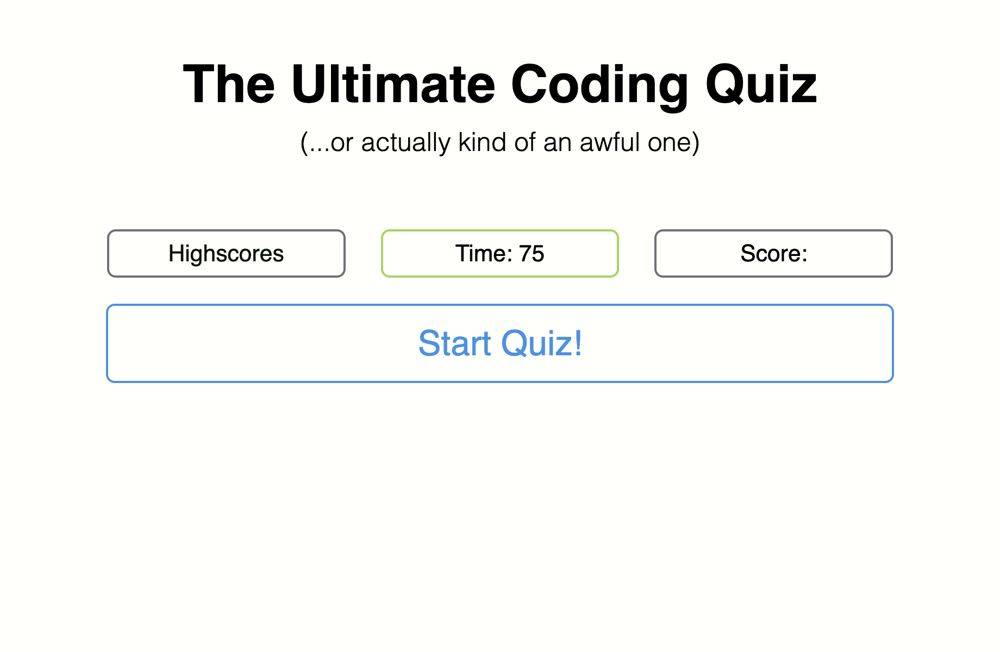
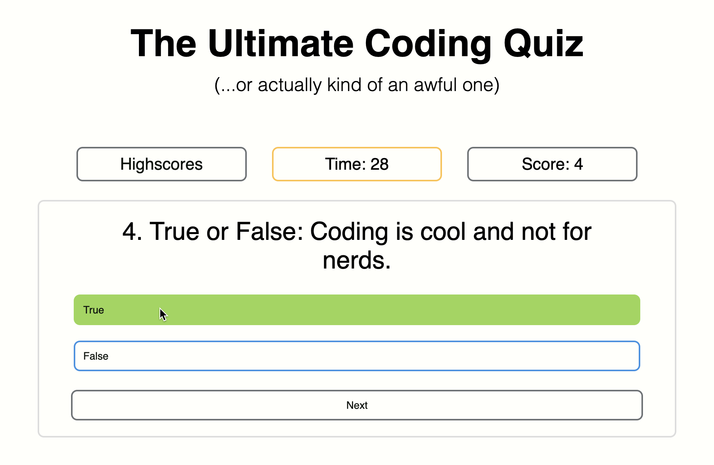
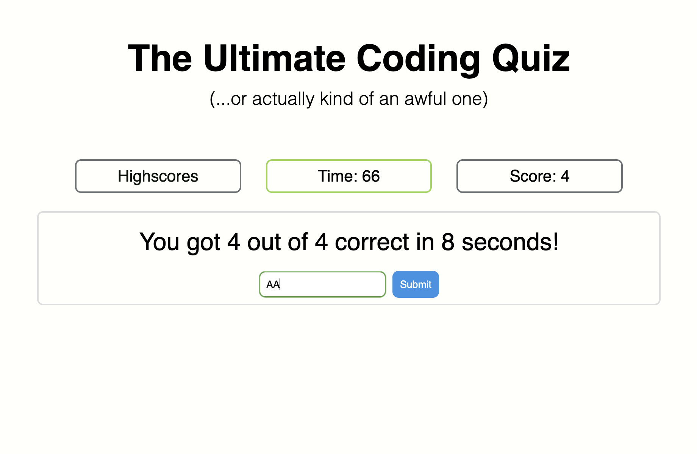
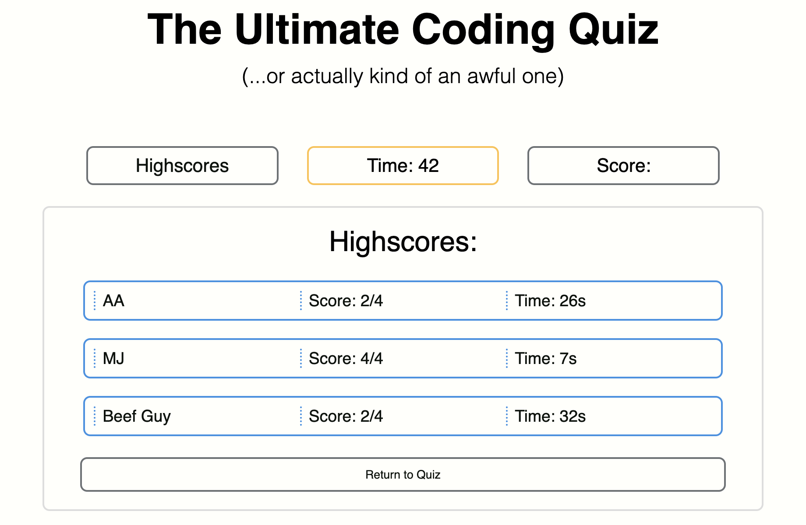

# JavaScript Code Quiz

A multiple-choice coding quiz featuring a timer, scoring system, highscore board, and some very, very cool questions. 

## Description

Provide a short description explaining the what, why, and how of your project. Use the following questions as a guide:

- This project was created to build a project that could quiz myself on coding knowledge and track my progress as I retake the quiz in the form of a scoreboard. This project solves the issue of a lack of study tools, as I can easily populate more questions into the quiz and use it to refresh myself on topics later down the line.

- In the grand scheme of things, this project became less of a study tool on the user side, and more of an opportunity to explore and understand JavaScript on the developer side. I spent time studying efficient ways to build systems, how those systems interact with each other, and how to build larger code repos that don't become an absolute mess (I think I did an OK job on that last part).

- Throughout building this project, I felt that I greatly increased my understanding of creating elements in JS using stored data and using localstorage. I felt I was able to grasp some fundamentals about building apps dynamically through code, which makes me feel more confident moving forward into more advanced endeavors.

## Usage

### [Take the Ultimate JavaScript Quiz here!](https://abealberts.github.io/js-code-quiz/)
please take it

### Screenshots:

#### Start Screen:

#### Active Quiz:

#### Score Submission:

#### Highscore Board:

(Honestly, I expected better from Beef Guy...)

## Credits

#### Tutorials referenced:
[GreatStack - Making a Quiz App in JS](https://www.youtube.com/watch?v=PBcqGxrr9g8)
^ Great video to better understand how to efficiently create elements with JS and change 'states'. I borrowed a lot of the base logic for the questions system and integrated the other acceptance criteria into it.

## License

MIT License

Copyright (c) 2023 Abe

Permission is hereby granted, free of charge, to any person obtaining a copy
of this software and associated documentation files (the "Software"), to deal
in the Software without restriction, including without limitation the rights
to use, copy, modify, merge, publish, distribute, sublicense, and/or sell
copies of the Software, and to permit persons to whom the Software is
furnished to do so, subject to the following conditions:

The above copyright notice and this permission notice shall be included in all
copies or substantial portions of the Software.

THE SOFTWARE IS PROVIDED "AS IS", WITHOUT WARRANTY OF ANY KIND, EXPRESS OR
IMPLIED, INCLUDING BUT NOT LIMITED TO THE WARRANTIES OF MERCHANTABILITY,
FITNESS FOR A PARTICULAR PURPOSE AND NONINFRINGEMENT. IN NO EVENT SHALL THE
AUTHORS OR COPYRIGHT HOLDERS BE LIABLE FOR ANY CLAIM, DAMAGES OR OTHER
LIABILITY, WHETHER IN AN ACTION OF CONTRACT, TORT OR OTHERWISE, ARISING FROM,
OUT OF OR IN CONNECTION WITH THE SOFTWARE OR THE USE OR OTHER DEALINGS IN THE
SOFTWARE.